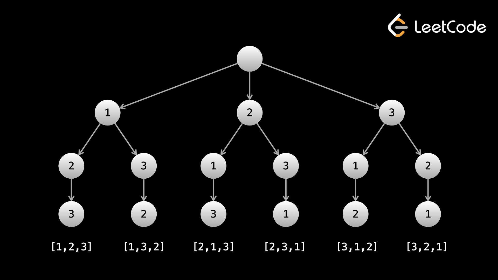

# Backtracking
The most brute force way to solve a problem is through __exhaustive search__. Generate all possibilities and then check each of them for a solution.

__Backtracking is a way to efficiently run through all possibilities in a problem__. It typically uses an optimization that involves abandoning a __path__ once it is determined that the path cannot lead to a solution. __The idea is similar to binary search trees__ - if you're looking for a value `x`, and the root node has a value greater than `x`, then you know you can ignore the entire right subtree.

Abandoning a path is also sometimes called __pruning__.

To summarize the difference between __exhaustive search__ and __backtracking__:

- In an exhaustive search, we generate all possibilities and then check them for solutions.
- In __backtracking__, we __prune__ paths that cannot lead to a solution, generating far fewer possibilities.

Backtracking is a great tool whenever a problem wants you to find __all__ of something, or there isn't a clear way to find a solution without checking all logical possibilities. On LeetCode, a strong hint that you should use backtracking is if the input constraints are very small (`n <= ~15`), as __backtracking algorithms usually have exponential time complexities__.

## Implementation
__Backtracking is almost always implemented with recursion__ - it really doesn't make sense to do it iteratively. In most backtracking problems, you will be building something, either directly (like modifying an array) or indirectly (using variables to represent some state). Here is some pseudocode for a general backtracking format:

```
// let curr represent the thing you are building
// it could be an array or a combination of variables

function backtrack(curr) {
  if (base case) {
    Increment or add to answer
    return
  }

  for (iterate over input) {
    Modify curr
    backtrack(curr)
    Undo whatever modification was done to curr
  }
}
```

Let's think back to the analogy of possibilities being represented by a tree.

Each call to the function `backtrack` represents a `node` in the tree. Each iteration in the for loop represents a child of the current `node`, and __calling `backtrack` in that loop represents moving to a child__.

__The line where you undo the modifications is the "backtracking" step and is equivalent to moving back up the tree from a child to its parent__.

At any given node, the path from the root to the node represents a candidate that is being built. __Arriving at a leaf node indicates that a complete solution has been built__, i.e. the __base case__ has been reached. The root of this tree is an empty candidate and represents the scope that the original backtrack call is being made from.

In this chapter, we will use trees to represent the backtracking process, as it is a very intuitive way to think about these problems.

## Generation
One common type of problem that can be solved with backtracking are __problems that ask you to generate all of something__, e.g. the following can be implemting using backtracking:

- Find all __permutations__ of a list of numbers. A permuation contains __all__ of the elements of the original list, in a __unique order without duplicates__.
  - The permuations of `[1,2,3]` are `[[1,2,3], [1,3,2], [2,1,3], [2,3,1], [3,1,2], [3,2,1]]`.
- Find all __subsets__ of a list of numbers, e.g. the subsets of `[1,2,3]` are `[[], [1], [2], [1,2], [3], [1,3], [2,3], [1,2,3]]`.
  - Note that `[1, 2, 3]` and `[3, 2, 1]` are __different permutations__, but they are the __same subset__.
- Find all __combinations__ of `k` integers in the range `[1,n]`, i.e. "$n$ choose $k$".
  - Given `n = 4` and `k = 2`, the following combiantions are possible:  `[[2,4], [3,4], [2,3], [1,2], [1,3], [1,4]]`.
  - This problem is _actually_ asking for __all subsets of the range `[1, n]` that are length `k`__, so we can apply the same algorithm to finding all __subsets__.

### Find All Permutations via Backtracking
Let's build each permutation using a recursive function `backtrack(curr)`, where `curr` is the current permutation being built. The __base case__ would be when `curr.length == nums.length`, i.e. we have completed a permutation and can't go further. On the base case, add `curr` to the answer and return.

To build all permutations, we need all elements at the first index, and for each of those elements, we need all other elements at the second index, and so on. Therefore, we should loop over the entire input on each call to `backtrack`. Because a permutation cannot have duplicates, we should check if a number is already in `curr` before adding it to `curr`. Each call to `backtrack` is like a visit to a node in the tree of possibilities.

Using `nums = [1, 2, 3]`, the answer "tree" looks like:



__The leaves are the base cases/answers to the problem__.

```
vector<vector<int>> permute(vector<int>& nums) {
  vector<vector<int>> ans;
  vector<int> curr = {};
  backtrack(curr, ans, nums);
  return ans;
}

void backtrack(vector<int>& curr, vector<vector<int>>& ans, vector<int>& nums)
{
  if (curr.size() == nums.size()) {
    ans.push_back(curr);
    return;
  }
  
  for (int num: nums) {
    if (find(curr.begin(), curr.end(), num) == curr.end()) {
      curr.push_back(num);
      backtrack(curr, ans, nums);
      curr.pop_back();
    }
  }
}
```

### Find All Subsets via Backtracking
There are two main difference between a __subset__ and a __permutation__:

- __Length__: __a subset can have any length__, whereas a permutation has a fixed length `n`.
- __Order of elements__: `[1, 2, 3]` and `[3, 2, 1]` are __different permutations__, but they are the __same subset__.

The valid subsets of `nums = [1, 2, 3]` are `[[], [1], [2], [1,2], [3], [1,3], [2,3], [1,2,3]`. We can take advantage of the __sorted__ nature of the answer, i.e. for every number `nums[i]`, only numbers after index `i` show up after it, to build our solution.

To avoid duplicates while still finding every subset, we can pass an integer `i` into our `backtrack` function that represents where we should start iterating. When we loop over the input, we loop over `[i, n)` instead of `[0, n)`. On calls to `backtrack`, we can pass in the index of the number we are adding plus one to make sure we only include numbers after the one we are adding for the rest of the subtree.

__This is a very common method of avoiding duplicates in backtracking problems - having an integer argument that represents a starting point for iteration at each function call__.

```
vector<vector<int>> subsets(vector<int>& nums) {
  vector<vector<int>> ans;
  vector<int> curr = {};
  backtrack(curr, 0, ans, nums);
  return ans;
}

void backtrack(vector<int>& curr, int i, vector<vector<int>>& ans, vector<int>& nums)
{
  if (i > nums.size()) {
    return;
  }
  
  ans.push_back(curr);
  for (int j = i; j < nums.size(); j++) {
    curr.push_back(nums[j]);
    backtrack(curr, j + 1, ans, nums);
    curr.pop_back();
  }
}
```

__This time our base case is when `i > nums.length` - we have run out of numbers to use__. The modification of curr and the undoing of the modification remain the same.

__You may notice that the base case is never actually hit because the function can't be called with an argument greater than the length of the input__. We have included the condition for clarity.

### Find All Combinations via Backtracking
A __combination__, sometimes referred to as "$n$ choose $k$, __is actually the same problem as finding all subsets of langth `k` in thr range `[1,n]`__.

Because of the similiarities, we can repurpose the algorithm above, but switching when we add `curr` to the answer from every call to just the base case.

```
vector<vector<int>> combine(int n, int k) {
  this->k = k;
  this->n = n;
  vector<vector<int>> ans;
  vector<int> curr = {};
  backtrack(curr, 1, ans);
  return ans;
}

void backtrack(vector<int>& curr, int i, vector<vector<int>>& ans) {
  if (curr.size() == k) {
    ans.push_back(curr);
    return;
  }
  
  for (int num = i; num <= n; num++) {
    curr.push_back(num);
    backtrack(curr, num + 1, ans);
    curr.pop_back();
  }
}
```

As you can see, the idea and code behind each of these problems is very similar. __Remember to model the problem as a tree, and then figure out what children each node should have__.