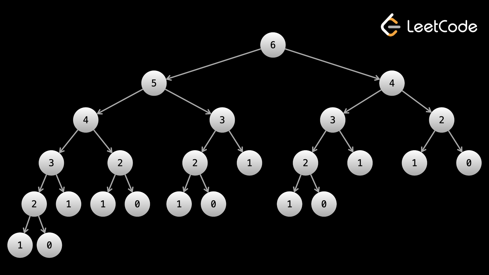

# Dynamic Programming
__Dynamic programming (DP) is a problem-solving technique__. Usually, problems where you use DP can only be solved with DP (in a reasonable time complexity). For many people, DP is the most feared topic. To be honest, there is a large stigma around DP. This is likely a combination of:

1. If you don't know DP, then it is almost impossible to solve a DP problem, even if it's an easy one.
2. DP isn't as common in interviews - some companies even ban it, which means people have less of an incentive to learn it.

## What Exactly is DP?
In short, __dynamic programming is just optimized recursion__.

Let's say you had some recursive function that returned the answer to the original problem treating whatever you call the function with as the input. We saw this idea extensively in the tree section. For example, we would frequently define a function dfs that took a node and returned the answer to the original problem as if the input was the subtree rooted at node.

The idea behind dynamic programming is the exact same. __We define some recursive function, usually called `dp`, that returns the answer to the original problem as if the arguments you passed to it were the input__.

The arguments that a recursive function takes represents a __state__. When we looked at tree problems, we never visited a node more than once in our DFS, which means that a state was never repeated. __The difference with DP is that states can be repeated, usually an exponential number of times__. To avoid repeating computation, we use something called __memoization__. When we find the answer (the return value) for a given state, we cache that value (usually in a hash map). Then in the future, if we ever see the same state again, we can just refer to the cached value without needing to re-calculate it.

### Generating the Fibonacci Sequence with DP
Let's look at Fibonacci numbers as an example. The $0^{th}$ Fibonacci number is `0`, the next one is `1`, and then each subsequent number is the sum of the previous two. The formula for the $n^{th}$ fibonacci number is: $ F_n = F_{n-1} + F_{n -2}$ (this is sometimes referred to as a _recurrence relation__). We can write a function that finds the $n^{th}$ Fibonacci number:

```
int fibonacci(int n) {
  if (n == 0) return 0;
  
  if (n == 1) return 1;
  
  return fibonacci(n - 1) + fibonacci(n - 2);
}
```

This algorithm has a time complexity of $O(2^n)$. This is because every call to `fibonacci` creates 2 more calls to `fibonacci`. Here's the recursion tree for `fibonacci(6)`:



As you can see, there is a lot of repeated computation - for example, `f(4)` is calculated twice, `f(3)` is calculated 3 times, and `f(2)` is calculated 5 times. At this size, it doesn't seem like a big deal. However, as `n` grows, the repeated computation grows exponentially. If we wanted to calculate `f(7)`, then this __entire__ tree would be just one side of the root.

In fact, __the most common cause of stack overflow is excessively deep or infinite recursion__, in which a function calls itself so many times that the space needed to store the variables and information associated with each call is more than can fit on the stack.

To avoid repeating computation (and avoid stack overflow), we can __memoize__ the results from our function calls. Let's use a hash map to store the results and check the hash map before making any recursive calls.

```
int fibonacci(int n) {
  // "memoize" the previously-computed results via a local static hash map
  static unordered_map<int, int> memo;

  if (n == 0) return 0;
  
  if (n == 1) return 1;
  
  if (memo.find(n) != memo.end()) {
    return memo[n];
  }
  
  memo[n] = fibonacci(n - 1) + fibonacci(n - 2);
  return memo[n];
}
```

This improves our time complexity to $O(n)$ - which is, of course, extremely fast compared to $O(2^n)$. The first approach is just basic recursion - __by memoizing results to avoid duplicate computation, it becomes dynamic programming__.

### Top-down vs. Bottom-up DP
This method of using recursion and memoization is also known as __top-down__ dynamic programming. It is named as such because we start from the top (the original problem) and move down toward the base cases. For example, we wanted the $n^{th}$ Fibonacci number, so we started by calling `fibonacci(n)`. We move down with recursion until we reach the base cases (`fibonacci(0)` and `fibonacci(1)`).

Another way to approach a dynamic programming problem is with a __bottom-up__ algorithm. In bottom-up, we start at the bottom (base cases) and work our way up to larger problems. This is done iteratively and also known as __tabulation__. Here is the bottom-up version of Fibonacci:

```
int fibonacci(int n) {
  std::vector<int> arr(n + 1);
  // base case - the second Fibonacci number is 1
  arr[1] = 1;
  for (int i = 2; i <= n; i++) {
    arr[i] = arr[i - 1] + arr[i - 2];
  }
  
  return arr[n];
}
```

Top-down and bottom-up refer only to how you decide to implement your algorithm. __There is fundamentally nothing different between the two approaches__. Every top-down implementation can be implemented bottom-up and vice versa. __The things that define a DP algorithm are the base cases and recurrence relation__.

There are pros and cons to both, but the main arguments for each are:

- __Usually, a bottom-up implementation is faster__. This is because __iteration has less overhead than recursion__, although this is less impactful if your language implements __tail recursion__.
  - Tail recursion is when there is only a __single recursive call__ in the function, __AND__ that call is the __last statement in the function__ (aside from `return`).
  - In C++, if __tail recursion optimization (TCO)__ is enabled (e.g., -O2 or -O3 for GCC and Clang), a tail-recursive function can be optimized to __reuse the current stack frame__ (by removing the recursion, and transforming it into a loop) instead of allocating a new one for each call. This prevents stack overflow errors and improves performance.
    - In other words, __optimized top-down DP is really just bottom-up DP__.
  - CPython, the standard Python interpreter, __does not implement tail recursion optimization__.
- However, __a top-down approach is usually easier to write__. __With recursion, the order that we visit states does not matter__. With iteration, if we have a multidimensional problem, it can sometimes be difficult figuring out the correct configuration of your for loops.

### When Should I Consider Using DP?
Problems that should be solved with DP usually have two main characteristics:

1. The problem will be asking for an optimal value (max or min) of something or the number of ways to do something.\
  1a. What is the minimum cost of doing ...\
  1b. What is the maximum profit of ...\
  1c. How many ways are there to ...\
  1d. What is the longest possible ...
2. At each step, you need to make a "decision", and decisions affect future decisions.\
  2a. A decision could be picking between two elements.\
  2b. Decisions affecting future decisions could be something like "_if you take an element x, then you can't take an element y in the future"_.

The second characteristic is usually what differentiates __greedy__ and __DP__. __The idea behind greedy is that local decisions do not affect other decisions__. Let's say we had `nums = [2,7,9,3,1]`, and we wanted to be greedy. Iterating along the array, the first decision is to take the `2` or the `7`, since we can't have both. If we were greedy, we would take the `7`. However, now we can no longer take the `9`. In fact, the optimal answer involves taking `2, 9, 1`. As you can see, __being greedy in our decisions affected future decisions which lead us to the wrong answer__.

### State
__State refers to a set of variables that can fully describe a scenario__. When we looked at tree problems, every recursive call to `dfs` took `node`, and maybe some other variables as arguments. These arguments represent the state. We'll see in the next article that __the first step to creating DP algorithms is deciding on what state variables are necessary__.

When we talked about trees, we said that each function call to `dfs` would return the answer to the original problem as if the state passed to the call was the input. With DP, it's the same. __A call to `dp(state)` should return the answer to the original problem as if `state` were the input__.

The following are common state variables that you should think about:

- __An index along an input string, array, or number__. This is the most common state variable and will be a state variable in almost all problems, and is frequently the only state variable. With Fibonacci, the "index" refers to the current Fibonacci number. If you are dealing with an array or string, then this variable will __represent the array/string up to and including this index__.
- __A second index__ along an input string or array. Sometimes, you need another index variable to represent the __right bound__ of the array or current search window.
- __Explicit numerical constraints__ given in the problem. This will usually be given in the input as `k`. For example, _"you are allowed to remove `k` obstacles"_. This state variable would represent how many more obstacles we are allowed to remove.
- __A boolean to describe a status__. For example, _"`true` if currently holding a package, `false` if not"_.

__The number of state variables used IS the dimensionality of an algorithm__. For example, if an algorithm uses only one variable like `i`, then it is one dimensional. If a problem has multiple state variables, it is multi-dimensional.

### Time and Space Complexity of DP Algorithms
Complexity analysis for DP algorithms is very easy. Like with trees/graphs, we calculate each state only once. Therefore, __if there are $N$ possible states, and the work done at each state is $F$, then your time complexity will be $O(N \cdot F)$.__ Notice that this is the exact same argument we used in the tree and graph problems.

__The space complexity will be $O(N)$.__ If we are doing top-down, our hash map will store all the states at the end. If we are doing bottom-up, the array we use for tabulation will be the same size as the number of states.

In many problems, __the space complexity can be improved when implementing bottom-up, but not top-down__.

The number of states $N$ is equal to the __cardinality__ of the state variables. To calculate $N$, look at each of your state variables, calculate the range of values they can take, and then multiply them together.

## Framework for DP
Consider the following problem: [Min Cost Climbing Stairs](https://leetcode.com/problems/min-cost-climbing-stairs/description/)

- __Given__: An integer array `cost` where `cost[i]` is the cost of the $i^{th}$ step on a staircase. Once you pay the cost, you can either climb one or two steps. You can either start from the step with index `0`, or the step with index `1`.
- __Return__: The minimum cost to reach the top of the floor (outside the array, not the last index of `cost`).

### The Framework
To create any DP algorithm, there are 3 main components.

1. A __function__ or __data structure__ that will compute/contain the answer to the problem for any given __state__. Writing this function effectively means cosidering two things:\
  1a. What should the function __return__?\
  1b. What __state__ should the function operate on, i.e. what arguments should the function take?
2. A __recurrence relation__, i.e. the __state transition function__.
3. One or more __base case(s)__ prevent infinite revcursion and allow our function to return useful values. 

Let's look at each of these three elements in the context of the stair climbing problem.

1. Let's write a function `int dp(i)` that does the following:\
  1a. It returns the minimum cost to climb the stairs up to the $i^{th}$ step.\
  1b. It takes a single argument, the stair index `i`, as its __state__.
2. Recall that at each step, we are allowed to take one or two steps forward. The cost to arrive at the $n^{th}$ step is the minumum of the cost to arrive at the $(n-1)^{th}$ step plus the cost cost of the $(n-1)^{th}$ step, and the cost to arrive at the $(n-2)^{th}$ step plus the cost cost of the $(n-2)^{th}$ step.\
  2a. We can epxress the recursive relationship as: `dp(i) = min(dp(i-1) + cost[i-1], dp(i-2) + cost[i-2])`.
3. In this case, the problem state that we can begin at either step `0` or step `1`, therefore the base case in this example will be: `dp(0) = dp(1) = 0`.

### Implementation
Solving this problem requires combining all 3 components above into an algorithm. Don't forget to __memoize__ the function to improve the time complexity from $O(2^n)$ to $O(n)$, where $n$ is the length of the input array.

```
int minCostClimbingStairs(const std::vector<int>& cost) {
  // Memoize (cache) the results in a local static variable.
  static memo = std::vector(cost.size() + 1, -1);

  // Define the recurrence relation as a function.
  std::function<int(int)> dp = [&dp](int idx) {
    if (i <= 1) {
      return 0;
    }

    if (memo[i] != -1) {
      return memo[i];
    }

    memo[i] = std::min(dp(i - 1) + cost[i - 1], dp(i - 2) + cost[i - 2]);
    return memo[i];
  }

  // Find the minimum cost to climb the stairs.  
  return dp(cost.size());
}
```

### Converting a Top-down Solution to a Bottom-up Solution
We can convert a top-down DP algorithm to a bottom-up DP algorithm by taking the following steps:

1. Begin by implementing the top-down approach.
2. itialize an array `dp` that is sized according to the state variables. For example, let's say the input to the problem was an array `nums` and an integer `k` that represents the maximum number of actions allowed. Your array `dp` would be 2D with one dimension of length `nums.size()`
nums.length and the other of length `k`. Since we want these two approaches to be equivalent, the return value of `dp(4, 6)` can now be found at `dp[4][6]`.
3. Set your base cases, same as the ones you are using in your top-down function.
4. Write a for-loop(s) that iterate over your state variables. If you have multiple state variables, you will need nested for-loops. These loops should s__tart iterating from the base cases and end at the answer state__.
5. Each iteration of the inner-most loop represents a given state, and is equivalent to a function call operating on the same state in the top-down algorithm. Therefore, we can simply copy-paste the logic from our `dp()` function, but simply change the recusrive fucntion call to `dp(...)` to accessing/modifying or array `dp[...]`.
6. We're done! `dp[...]`is now an array populated with the answer to the original problem for all possible states.

Below is the bottom-up solution to the same problem

```
int minCostClimbingStairs(const std::vector<int>& cost) {
  int n = cost.size();
  // Step 2
  std::vector<int> dp(n + 1);

  // Step 3: Base cases are implicitly defined as they are 0

  // Step 4
  for (int i = 2; i <= n; i++) {
    // Step 5
    dp[i] = std::min(dp[i - 1] + cost[i - 1], dp[i - 2] + cost[i - 2]);
  }
  
  // Step 6
  return dp[n];
}
```

## 1D Problems

## Multi-dimensional Problems

## Matrix DP