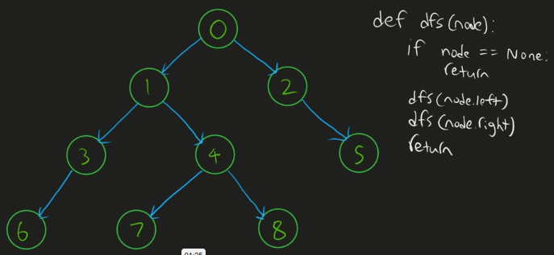
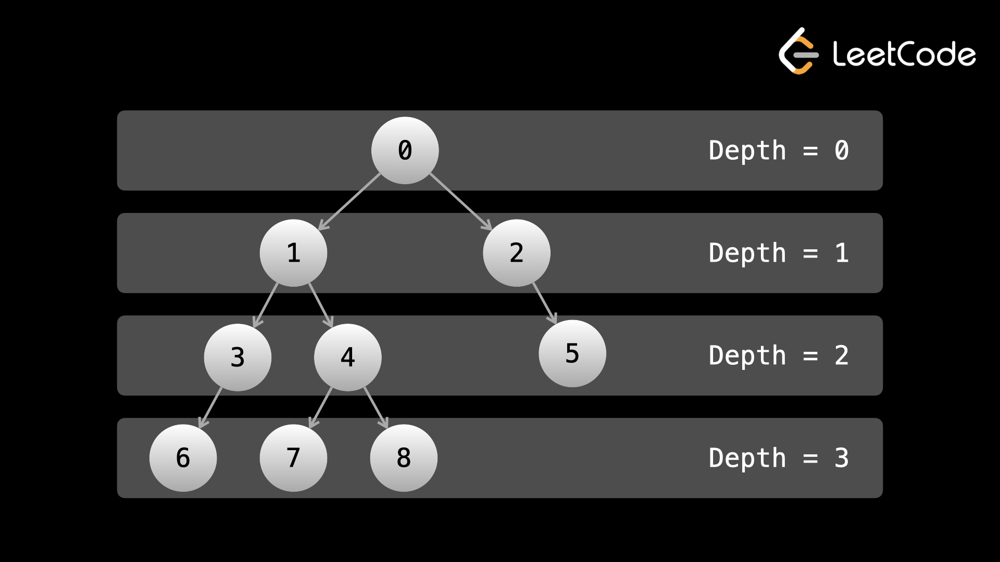

# Trees and Graphs
In this chapter, we will be learning about __trees__ and __graphs__, which is probably the __most common__ type of interview question. Trees and graphs are abstract data structures that show up everywhere in both the physical world and the software world. This is the longest chapter of the course, but for good reason. A huge amount of interview problems give trees or graphs as the input, and the entire problem is focused on them. As such, it is crucial that anyone going into a coding interview has a strong understanding of them.

## Binary Trees

### Nodes and Graphs

Let's start by revisiting what a __node__ is. We looked at nodes in the linked lists chapter - recall that a node is an abstract data type with two things. __First, a node stores data__. This data can be whatever you want - an integer, a boolean, a hash map, your own custom objects, or all of the above. __Second, a node stores pointers to other nodes__.

A graph is any collection of nodes and their pointers to other nodes. In fact, linked lists and trees are both types of graphs. As a topic, graphs are extremely broad.

Even though __a tree is a type of graph__, trees and graphs are considered different topics when it comes to algorithm problems. Because graphs are the more advanced/difficult topic, we will start by looking at trees.

The nodes of a graph are also called __vertices__, and the pointers that connect them are called __edges__.

### What is a Tree?
Like a linked list, __a tree is a type of graph__. Also like a linked list, there are multiple types of trees. In this course, we will be focusing on __binary trees__.

Recall that the start of a linked list was called the __head__. The start of a binary tree is called the __root__. In a linked list, a node's pointer pointed to the next node. In a tree, a node has pointers to its __children__. __Note that in a tree, a node cannot have more than one parent__.

So what makes a binary tree _binary_? In a binary tree, __all nodes have a maximum of two children__. These children are referred to as the __left child__ and the __right child__. _Note that there isn't really a difference between a child being on the left or the right, it's just the convention used to refer to the children and convenient for graphical representations_.

### Tree Terminology
There is some tree-specific terminology that we will need to learn.

| Term        | Definition | Additional Information |
|:------------|:-----------|:----------------|
| __root__    | The root node has no parent and is positioned at the "top" of the tree. | In most tree questions, the root of the tree will be given as the input, just like how in linked lists, the head was given as the input. |
| __leaf__    | A leaf node has no children. | |
| __depth__   | The depth of a node is how far it is from the root node. | The root node has a depth of `0`. |
| __subtree__ | A subtree of a tree is a node and all its descendants. | Trees are recursive - you can treat a subtree as if it was its own tree with the chosen node being the root. |

The idea of __subtrees__ is the most fundamental idea for solving tree problems - __you can take any given node and treat it as its own tree, which allows you to solve problems in a recursive manner__.

### Code Representation
Just like with a linked list, binary trees are implemented using objects of a custom class. This is the typical class definition that will be provided to you in algorithm problems:

```
template<typename T>
struct TreeNode {
  T val;
  TreeNode* left;
  TreeNode* right;

  TreeNode(T val) : val(val), left(nullptr), right(nullptr) {}
  TreeNode(T val, TreeNode* left, TreeNode* right) : val(val), left(left), right(right) {}
};
```

In binary tree problems, you will be given a reference to the `root` of a binary tree as the input. You can access the root's __left subtree__ with `root.left` and the root's __right subtree__ with `root.right`. In a binary tree, if a node does not have a left child, then `node.left` will be `null`, and vice-versa with the `right` child. Remember that if both children are `null`, then the node is a __leaf__.

### Binary Trees - Depth First Search (DFS)
In this article, we'll talk about how to traverse binary trees. __Tree traversal is how we access the elements of a tree__, and thus is mandatory for solving tree problems.

Recall that when traversing linked lists, we usually do it __iteratively__. With binary trees, we usually do it __recursively__.

There are two main types of tree traversals. The first is called __depth-first search (DFS)__. For binary trees specifically, there are __3 ways to perform DFS - preorder, inorder, and postorder__ (don't worry though, the type you choose rarely matters). The other main type of traversal is called __breadth-first search (BFS)__.

Recall that the __depth__ of a node is its distance from the root. In a DFS, we prioritize depth by traversing as far down the tree as possible in one direction (until reaching a leaf node) before considering the other direction. For example, let's say we choose left as our priority direction. We move exclusively with `node.left` until the left subtree has been fully explored. Then, we explore the right subtree.

Let's create a simple binary tree to understand how the tree is explored via DFS.



Because we need to backtrack up the tree after reaching the end of a branch, DFS is typically implemented using recursion, although it is also sometimes done iteratively using a stack. 

```
void dfs(TreeNode* node) {
  if (node == nullptr) {
      return;
  }
  
  std::cout << node->val << ",";
  dfs(node->left);
  dfs(node->right);
  return;
}

int main {
  // Create the tree (from the leaves to the root)
  TreeNode<int> six(6), seven(7), eight(8);
  TreeNode<int> three(3, &six, nullptr), four(4, &seven, &eight), five(5);
  TreeNode<int> one(1, &three, &four), two(2, nullptr, &five);
  TreeNode<int> root(0, &one, &two);

  // Perform the Depth First Serach (DFS) starting from the root node
  dfs(&root);
}
```

For the code above, we'll get the following output:

```
0, 1, 3, 6, 4, 7, 8, 2, 5
```

The good news is that the structure for performing a DFS is very similar across all problems. It goes as follows:

1. Handle the base case(s). Usually, an empty tree,m i.ee `node == nullptr` is the base case.
2. Do some logic on the current node.
3. Recursively call the node's children.
4. Return the answer.

_Note that steps 2 and 3 may happen in reverse order (as seen in the output above)_.

The most important thing to understand when it comes to solving binary tree problems is that __each function call solves and returns the answer to the original problem as if the subtree rooted at the current node was the input__. The logic that will be done at each call (step 2) will depend on the problem.

We mentioned that there are three types of DFS. Each of the three types differs only in the order that they execute steps 2/3.

#### Pre-Order Traversal
In __pre-order traversal__, logic is done on the current node before moving to the children. The example shown above where we print the node's `val` to the terminal prior to calling `dfs` recursively on the left then the right node is an example of __pre-order traversal__. The output from above is repeated below for reference.

```
0, 1, 3, 6, 4, 7, 8, 2, 5
```

Because the logic (printing) is done immediately at the start of each function call, preorder handles nodes in the same order that the function calls happen.

#### In-order Traversal
For __in-order traversal__, we first recursively call the left child, then perform logic (print in this case) on the current node, and then recursively call the right child. This means no logic will be done until we reach a node without a left child since calling on the left child takes priority over performing logic.

We can modify the `dfs` code to perform __in-order traversal__ as follows:

```
dfs(node->left);
std::cout << node->val << ",";
dfs(node->right);
return;
```

and we'll obtain the following output:

```
6, 3, 1, 7, 4, 8, 0, 2, 5
```

#### Post-Order Traversal
In __post-order traversal__, we recursively call on the children first and then perform logic on the current node. This means __no logic will be done until we reach a leaf node since calling on the children takes priority over performing logic__. In a post-order traversal, the root is the last node where logic is done.

We can modify the `dfs` code to perform __post-order traversal__ as follows:

```
dfs(node->left);
dfs(node->right);
std::cout << node->val << ",";
return;
```

and we'll obtain the following output:

```
6, 3, 7, 8, 4, 1, 5, 2, 0
```

The name of each traversal type describes when the current node's logic is performed.

| Traversal Type | Logic Evaluation Order                 |
|:---------------|:---------------------------------------|
| __pre__-       | before both children                   |
| __in__-        | after the left child, before the right |
| __post__-      | after both children                    |

#### Solving Problems with DFS
Consider the probelm of finding the [maximunm depth of of a binary tree](https://leetcode.com/problems/maximum-depth-of-binary-tree/) given the root of the tree.

Let's start with a __recursive approach__. When thinking about designing recursive functions, a good starting point is always the base case. What is the depth of an empty tree (zero nodes, root is `null`)? The depth is `0`.

```
int maxDepth(TreeNode* root) {
  if (root == nullptr) {
      return 0;
  }
  
  int left = maxDepth(root->left);
  int right = maxDepth(root->right);

  // The current node contributes 1 to the depth.
  return std::max(left, right) + 1;
}
```

A really important concept regarding recursion is that __each function call stores its own variables__. Because we are calling the function for each node, that means every node has its own unique values of `left` and `right`.

What about an __iterative implementation__? In the solution above, we are doing a __post-order traversal__ because the logic for the current node (basically just the return statement) happens after the calls. __All three types of DFS can be implemented iteratively, but postorder and inorder are more complicated to implement than preorder (which is very easy)__. As we mentioned earlier, for most problems, the type of DFS doesn't matter, so we'll take a look at a preorder DFS implemented iteratively.

```
int maxDepth(TreeNode* root) {
  if (root == nullptr) {
    return 0;
  }
  
  stack<pair<TreeNode*, int>> stack;
  stack.push(pair(root, 1));
  int ans = 0;
  
  while (!stack.empty()) {
    auto [node, depth] = stack.top();
    stack.pop();
    ans = max(ans, depth);
    
    if (node->left != nullptr) {
      stack.push(pair(node->left, depth + 1));
    }
    
    if (node -> right != nullptr) {
      stack.push(pair(node->right, depth + 1));
    }
  }
  
  return ans;
}
```

This iterative implementation may be more intuitive if you are not used to recursion. The format for performing the traversal with the stack is something that can be easily re-used between problems. We make use of a stack and use a while loop until the stack is empty. In each iteration of the while loop, we handle a single node - this is equivalent to a given function call in the recursive implementation. All the logic that is done in the function should be done in the while loop, including handling the children, which is done by pushing to the stack.

#### Time and Space Complexity of DFS

The __time and space complexity__ of tree questions is usually straightforward. The __time complexity is almost always $O(n)$, where $n$ is the total number of nodes__, because __each node is only visited once__, and at each node, $O(1)$ work is done. If more than $O(1)$ work is done at each node, let's say $O(k)$ work, then the time complexity will be $O(n \cdot k)$.

For __space complexity, even if you are using recursion, the calls are still placed on the call stack which counts as extra space__. The largest the stack will be (for either iterative or recursive) at any time will depend on the tree. For recursion, in the worst case it is $O(n)$ if the tree is just a straight line, so usually, the correct answer to give for space complexity is $O(n)$. If the tree is __complete__ (all nodes have 0 or 2 children and each level except the last is full), then the space complexity is $O(\log n)$, but this is a best-case scenario.

### Binary Trees - Breadth First Dearch (BFS)
In DFS, we prioritized depth. In breadth-first search (BFS), we prioritize breadth. Recall that a node's depth is its distance from the root. In DFS, we always tried to go down as far as we could, increasing the depth of the current node until we reached a leaf.

In BFS, __we traverse all nodes at a given depth before moving on to the next depth__.

A __complete__ binary tree is one where every level (except possibly the last) is full, and all the nodes in the last level are as left as possible.



A BFS performed on the above tree would visit the nodes in the same order as their values. We visit all nodes at a depth `d` before visiting any node at a depth of `d + 1`.

#### When to use BFS vs DFS?
While DFS was implemented using a stack (recursion uses a stack under the hood by adding recursive function calls to the __call stack__), __BFS is implemented iteratively with a queue__. You _can_ implement BFS with recursion, but it wouldn't make sense as it's a lot more difficult without any benefit.

Implementing DFS is usually quicker because it requires less code, and is _easier_ to implement if using recursion, so for problems where BFS/DFS doesn't matter, most people end up using DFS. __But for problems where we want to handle each node according to its level, the obvious choice is BFS__.

In an interview, you may be asked some trivia regarding BFS vs DFS, such as their drawbacks

| Algorithm | Primary Drawback |
|:----------|:-----------------|
| DFS       | You may waste a lot of time looking for a value if that value just happens to be in the right subtree, and the left subtree happens to be __very deep__, i.e. hundreds of thousands, if not millions of nodes deep. |
| BFS       | If the node we're searching for is at or near the bottom of the tree, then it will take a long time to find. |

or questions about their space complexity.

| Algorithm | Space Complexity                                       | Perfect Tree | Lopsided Tree |
|:----------|:-------------------------------------------------------|:------------:|:-------------:|
| DFS       | linear with the height of the tree (the maximum depth) | $O(\log n)$  | $O(n)$        |
| BFS       | linear with the level containing the most nodes        | $O(n)$       | $O(1)$        | 

With an efficient queue, the dequeue and enqueue operations are $O(1)$, which means that the time complexity of BFS is the same as DFS. Again, the main idea is that we visit each node only once, so the time complexity is $O(n \cdot k)$ where $n$ is the total number of nodes, and $k$ is the amount of work we do at each node, usually $O(1)$.

#### BFS Code Implementation
Just like DFS, the code/implementations for BFS is very similar across different problems. Here is a general format (we're printing the values of the nodes as an example):

```
void printAllNodes(TreeNode* root) {
  queue<TreeNode*> queue;
  queue.push(root);
  
  while (!queue.empty()) {
    int nodesInCurrentLevel = queue.size();
    // Do some logic here for the current level

    for (int i = 0; i < nodesInCurrentLevel; i++) {
      TreeNode* node = queue.front();
      queue.pop();

      // do some logic here on the current node
      cout << node->val << endl;
      
      // put the next level onto the queue
      if (node->left) {
        queue.push(node->left);
      }
      
      if (node->right) {
        queue.push(node->right);
      }
    }
  }
}
```

At the start of each iteration inside the while loop (where the comment `"do some logic here for the current level"` is), the queue contains exactly all the nodes for the current level. In the beginning, that's just the root.

### Binary Search Trees

## Graphs

### Graphs - Depth First Search (DFS)

### Graphs - Breadth First Search (BFS)

## Implicit Graphs

Meta Roles:
- Hiring for "General" software engineering team:
- 3 different pillars
  - Product: building/maintaining products (backend, frontend)
  - Infrastructure (scalable, stable infrastructure, backend)
  - ML: develop and deploy generative models at scale
    - this is the role she's hiring for

  - Interview:
    - coding interview (45 mins)
    - 
